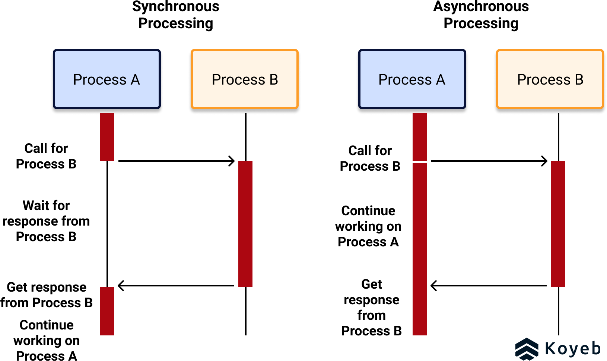

# Async & await (비동기 처리 방식)

Javascript는 [싱글 스레드(Single Thread)](https://github.com/hoijoii/TIL/blob/main/CS/OS/SingleThread.md) 프로그래밍 언어이기 때문에 비동기처리가 필수적입니다.

<br>

## 1. 동기식과 비동기식

- 동기(synchronous) : 응답을 받으면 다음 동작 실행
- 비동기(asynchronous) : 응답 상관 없이 다음 프로세스 진행



위 그림에서 볼 수 있듯, 동기식 프로세싱은 하나의 작업이 다음 작업 실행 전에 처리를 완료해야 합니다. 반면 비동기식 프로세싱은 다음 작업이 이전 작업 완료 전에 병렬로 실행됩니다.

#### 1-1. 동기식

AJAX는 보통 동기식을 많이 사용합니다. 해당 데이터를 가져와 다음 프로세스에서 함께 사용하는 경우가 많기 때문입니다.

- 한 번에 하나씩 처리하며 진행
- 순차적으로 처리하기 때문에 비동기에 비해서 결과 값이 느리게 나타남
- 디버깅이 쉬움

#### 1-2. 비동기식

여러 작업이 동시에 일어납니다. 일반 웹사이트는 보통 비동기식 프로세싱을 이용합니다. 이를테면 메인화면 노출과 컨텐츠 미리보기가 로딩되는 대로 뜨는 것처럼요.

- 여러 로직이 동시 처리
- 매우 빠르게 결과 도출
- 다른 프로세스 결과 값을 받아 쓰려면 동기식처럼 작동하도록 조절이 필요함

<br>

## 2. Promise와 async

Javascript에서 콜백 패턴으로 비동기처리를 할 수 있었지만, 가독성과 에러의 처리가 곤란하기 때문에 여러 비동기 처리를 한 번에 처리하는 데에 한계가 있었습니다. ES6에서 도입된 Promise는 콜백의 단점 보완 및 비동기 처리 시점을 명확히 표현할 수 있습니다.

async은 promise의 사용을 좀 더 직관적으로 표현합니다.

#### 2-1. Promise

미래의 어떤 시점에 결과를 제공하겠다는 'Promise(약속)'을 반환합니다. Promise는 비동기 처리가 성공(fulfilled)했는지, 실패(rejected)했는지 등의 상태 정보를 갖습니다.

| 상태      | 의미                                       |
| --------- | ------------------------------------------ |
| pending   | 비동기 처리가 수행되지 않은 상태           |
| fulfilled | 비동기 처리가 수행되어 성공한 상태         |
| rejected  | 비동기 처리가 수행되어 실패한 상태         |
| settled   | 비동기 처리가 수행되어 성공 or 실패한 상태 |

Promise의 문법은 아래와 같습니다.

```
const promise = new Promise((resolve, reject) => {
    if (/*비동기 작업 성공*/) {
        resolve('result');
    }
    else { /*실패*/
        reject(new Error('error'))
    }
});

//Promise의 후속 처리 메소드 - then: Promise 반환
promise().then((n) => console.log(n));
//promise().catch( ... ) 예외 발생 시 호출. Promise 반환
```

Promise 생성자 함수가 전달받은 콜백은 내부에서 비동기 처리를 수행하고, 이때 처리가 성공하면 resolve를 호출합니다. 실패 시에는 reject를 호출합니다.

#### 2-2. async

함수에 async을 추가하면 Promise 객체로 자동 인식해줍니다. return 값은 resolve()와 같습니다.

```
const promise2 = async () => {
    return 'result';
    // return Promise.resolve('result'); 와 같은 표현
}

promise2().then((n) => console.log(n));
```

하지만 리턴값이 문자열인 것은 아니고, Promise를 리턴합니다. 따라서 promise2 함수의 리턴값은 'Promise{\<resolved>:"result"} 입니다.

<br>

## 3. async & await

- async : async이 붙은 함수는 Promise 객체 반환
- await : 비동기로 처리되는 부분 앞에 붙여줌. 이 키워드를 만나면 <b>promise가 settled(처리)될 때까지 기다림.</b>

resolve(값) 되면 이 <b>'값'만 추출해 리턴합니다.</b>
await를 사용하면 promise.then보다 가독성 있고 쉽게 result를 얻을 수 있습니다.

```
const promise2 = async () => {
    return await 'result'
}
```

async & await를 사용하면 .then이 거의 필요하지 않습니다.(최종 결과 및 처리되지 못한 에러를 다룰 때 .then을 추가 사용) 아래처럼 promise.catch가 아닌 일반 try ... catch를 사용할 수 있다는 장점도 있습니다.

```
//axios를 통해 post 요청을 보낼 때(AJAX) 사용하였습니다.
const insertPost = async () => {
    try {
      return await axios.post(
        "urls",
        { ... },
        {
          headers: {
            ...
          },
        }
      );
    } catch (e) {
      return e.response ? e.response : e;
    }
  };

```

<br>

## Reference

- Koyeb(Introduction to Synchronous and Asynchronous Processing) : https://www.koyeb.com/blog/introduction-to-synchronous-and-asynchronous-processing
- GoCoder ITExpress : https://gocoder.tistory.com/1421
- poiemaweb (Promise) : https://poiemaweb.com/es6-promise
- JAVASCRIPT.INFO (async과 await) : https://ko.javascript.info/async-await
