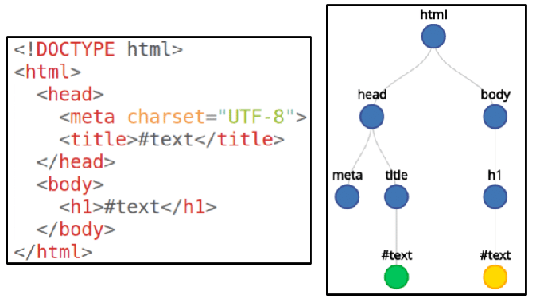

# Virtual DOM (VDOM)

UI로 표현될 객체를 가상 메모리에 저장하고, 라이브러리에 의해 실제 DOM으로 동기화하는 개념.

 

## 1. DOM

문서 객체 모델. 객체로 문서 구조를 표현하는 방법이며, 외부(js)와 접속할 인터페이스다. XML, HTML로 작성한다.

#### 1-1. DOM의 특징

- 웹 브라우저는 DOM을 활용해 객체에 js, CSS를 적용
- DOM은 트리 형태라서 특정 노드를 찾기/수정/제거하거나 원하는 곳에 삽입 가능

#### 1-2. DOM의 문제점과 해결법

- DOM은 빠르지만 웹 브라우저 단에서 DOM에 변화가 생기면 웹 브라우저가 CSS 다시 연산, 레이아웃 구성, 페이지 리페인트. ➔ 규모가 큰 웹 애플리케이션에서는 성능 이슈가 발생한다.
- React의 Virtual DOM 방식으로 DOM 업데이트 추상화 ➔ DOM 처리 횟수 최소화, 효율적으로 진행

 

## 2. Virtual DOM

실제 DOM에 접근하여 조작하는 것이 아니라 이를 추상화한 js 객체를 구성해 사용한다.

#### 2-1. Virtual DOM의 동작

&nbsp; ① state, props 갱신 시 전체 UI를 Virtual DOM에 리렌더링

&nbsp; ② 이전 VDOM과 새로운 VDOM 내용을 비교

&nbsp; ③ 바뀐 부분만 실제 DOM에 적용

#### 2-2. Virtual DOM의 장점

- "업데이트 처리 간결성" : UI 업데이트 과정에서 생기는 복잡함 해소, 더욱 쉽게 업데이트에 접근

- 가상의 DOM으로 한 번만 Reflow를 수행하므로 처리 횟수를 최소화하며 효율적

 

## Reference

- React : https://reactjs.org/docs/faq-internals.html
- 리액트를 다루는 기술, 김민준
